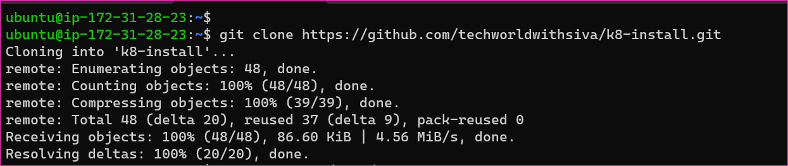
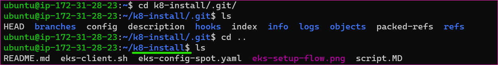
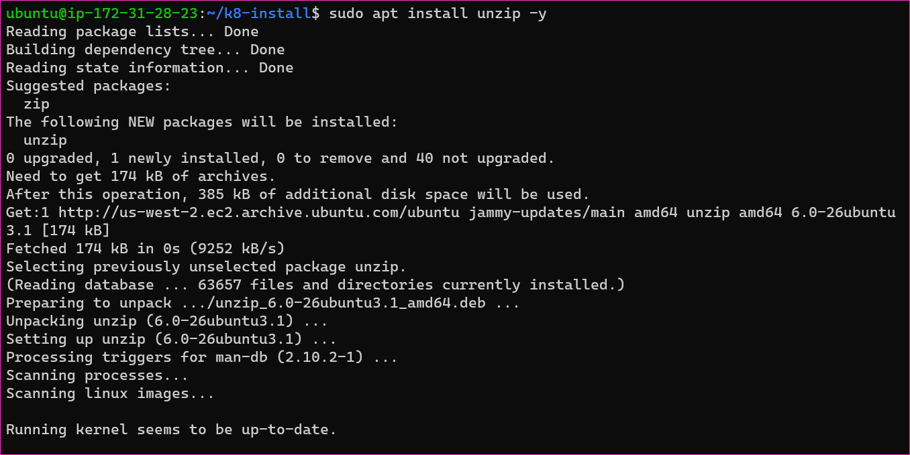
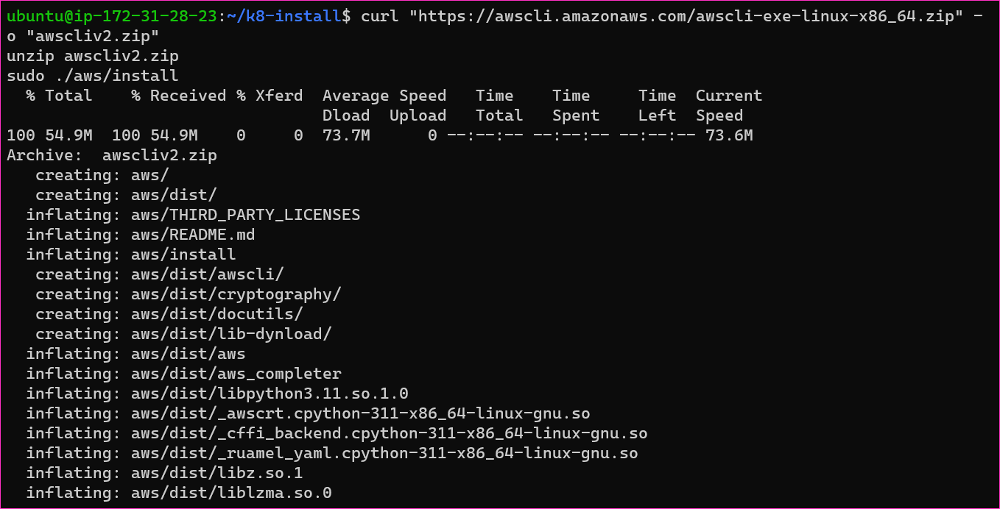
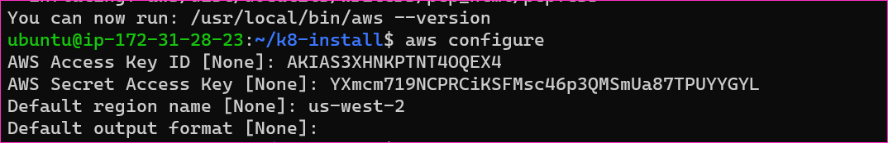
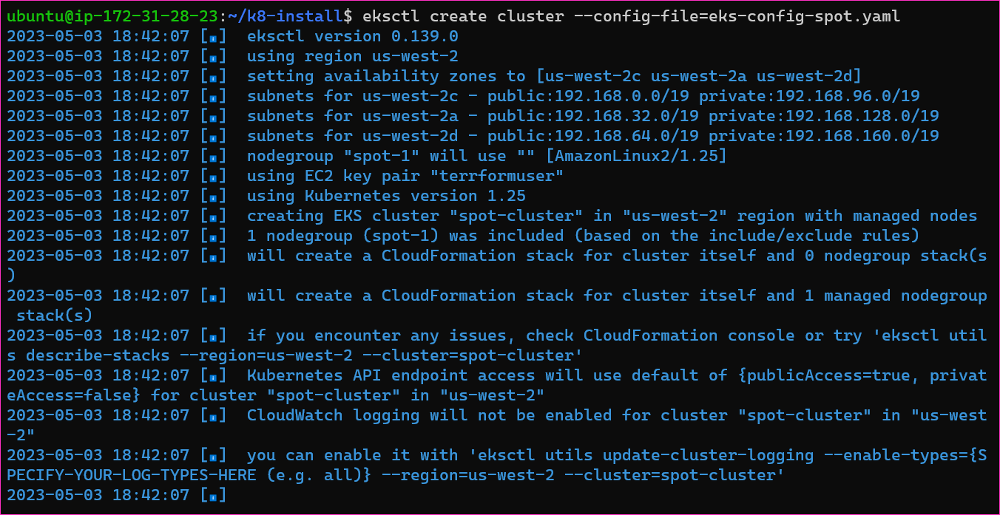
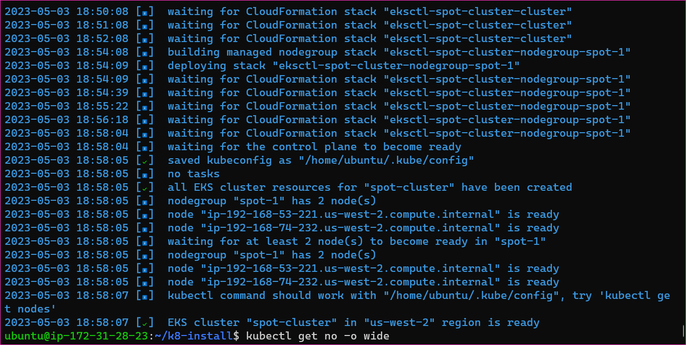
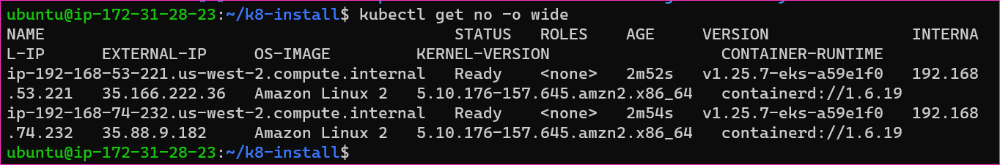
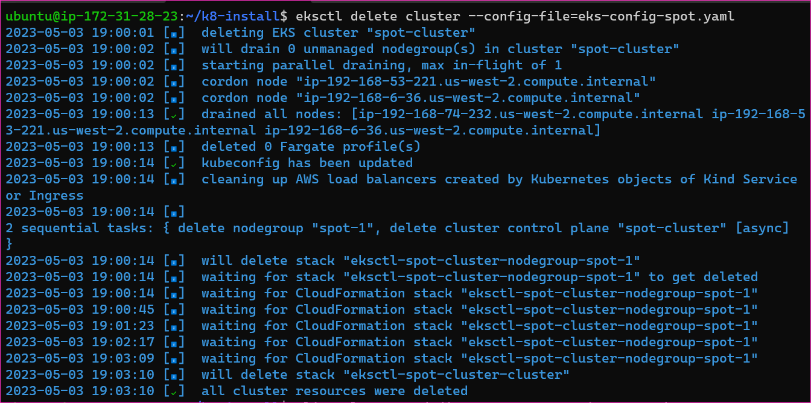

SCRIPT
-------

Steps:
------

* Create IAM user with administrator access. Create access_key and security_key. Don't keep these in GIT
* Create a work station of AWS Linux 2 OS. Install docker in it.

```
curl https://raw.githubusercontent.com/techworldwithsiva/docker-install-commands/master/docker-install.sh | sudo bash
```

* Clone this repo.

```
git clone https://github.com/techworldwithsiva/k8-install.git
```


* go to k8-install folder

```
cd k8-install
```


* Run eks-client.sh script to install AWS CLI V2, eksctl, kubectl

```
sudo sh eks-client.sh
```

* Run AWS configure. Enter AWS_ACCESS_KEY and AWS_SECRET_KEY created in first step.

```
aws configure
```





* Now we need to create EKS cluster with eksctl command. 
* Replace the SSH key with your key name and cluster name in `eks-config-spot.yaml` file

```
eksctl create cluster --config-file=eks-config-spot.yaml
```





* NOTE: When you completed practice delete the cluster.

```
eksctl delete cluster --config-file=eks-config-spot.yaml
```


* THANK YOU FOR READING!

