To install EKS Cluster
----------------------

* Take ec2 virtual machine with instance type of t2.medium
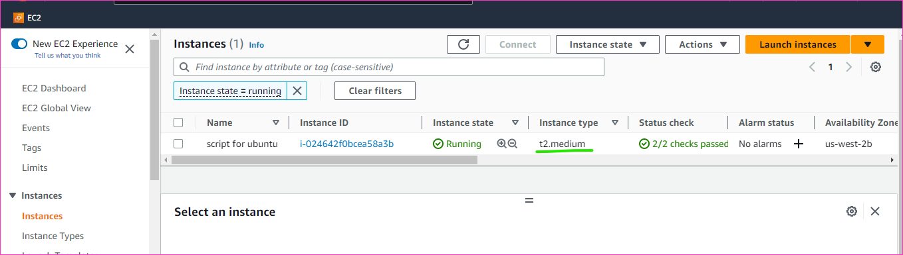

### Install aws cli
```
sudo apt install unzip -y
curl "https://awscli.amazonaws.com/awscli-exe-linux-x86_64.zip" -o "awscliv2.zip"
unzip awscliv2.zip
sudo ./aws/install
aws --version
```
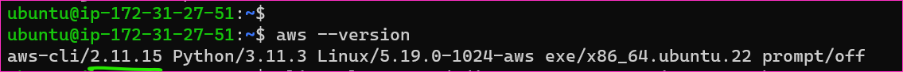

```
aws configure
```
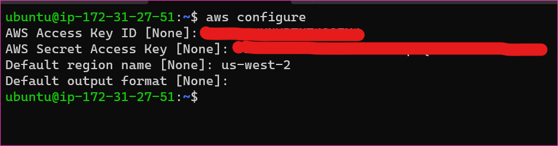

### To install or update kubectl

* Determine whether you already have kubectl installed on your device.
```
kubectl version --short --client
```

* If not present kubectl, then below commands are executed
```
curl -O https://s3.us-west-2.amazonaws.com/amazon-eks/1.23.17/2023-03-17/bin/linux/amd64/kubectl
curl -O https://s3.us-west-2.amazonaws.com/amazon-eks/1.23.17/2023-03-17/bin/linux/amd64/kubectl.sha256
sha256sum -c kubectl.sha256
openssl sha1 -sha256 kubectl
chmod +x ./kubectl
mkdir -p $HOME/bin && cp ./kubectl $HOME/bin/kubectl && export PATH=$PATH:$HOME/bin
echo 'export PATH=$PATH:$HOME/bin' >> ~/.bashrc
kubectl version --short --client
```
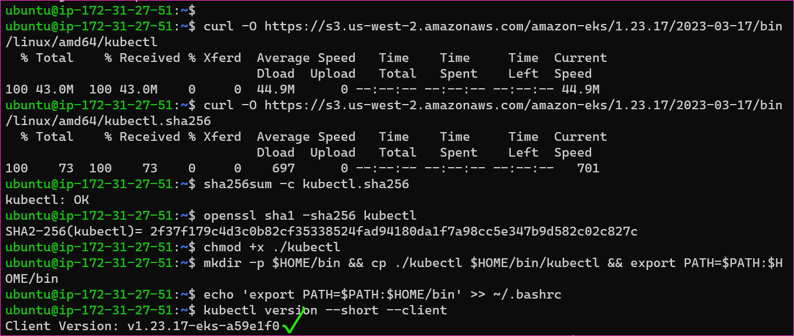

### Installing Terraform 

```
wget -O- https://apt.releases.hashicorp.com/gpg | sudo gpg --dearmor -o /usr/share/keyrings/hashicorp-archive-keyring.gpg
echo "deb [signed-by=/usr/share/keyrings/hashicorp-archive-keyring.gpg] https://apt.releases.hashicorp.com $(lsb_release -cs) main" | sudo tee /etc/apt/sources.list.d/hashicorp.list
sudo apt update && sudo apt install terraform
terraform --version
```

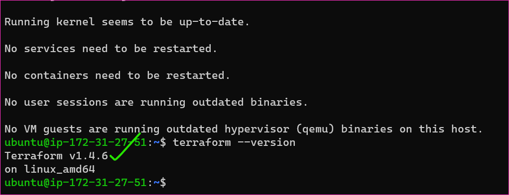
  

* To check the tree, to install tree in machine
```
sudo apt install tree
```
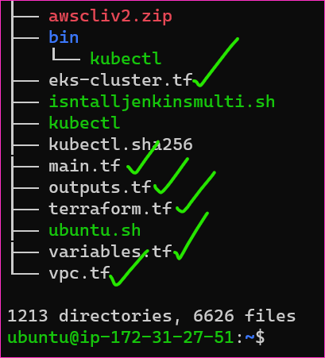

```
terraform init
```
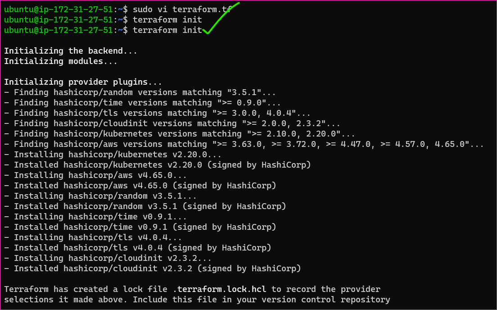
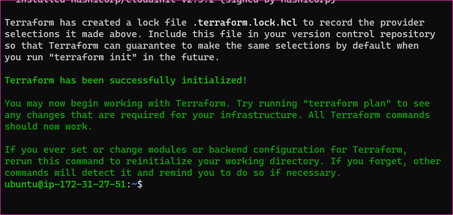

```
terraform validate
```
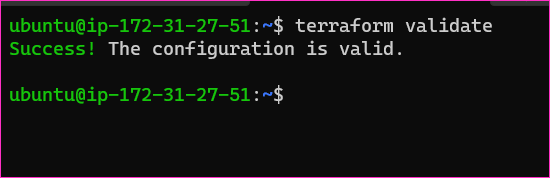

```
terraform plan
```
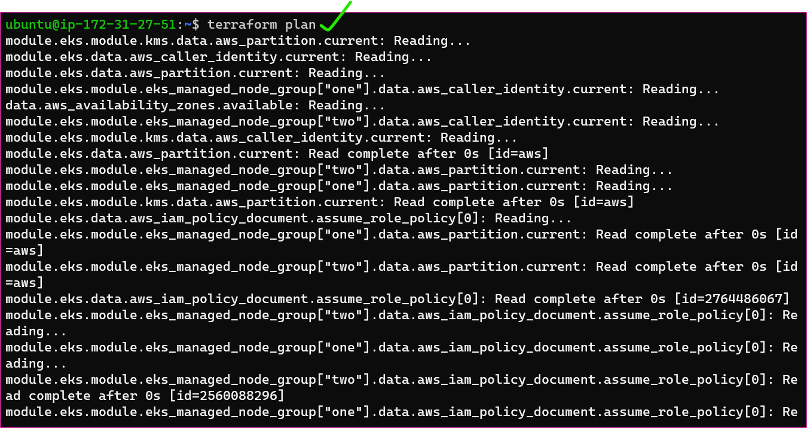
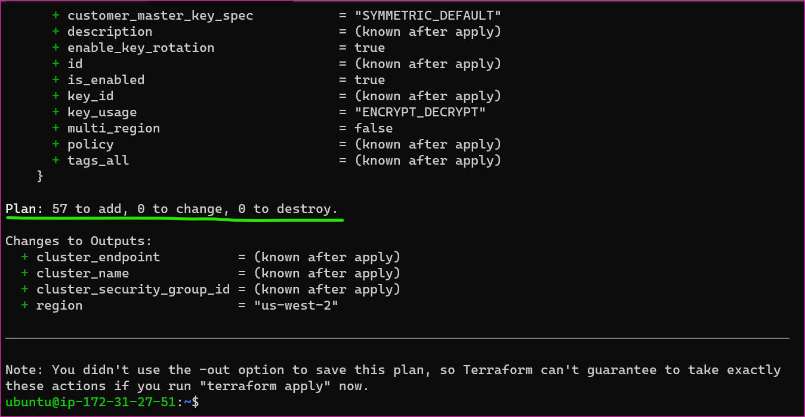


```
terraform apply -auto-approve
```
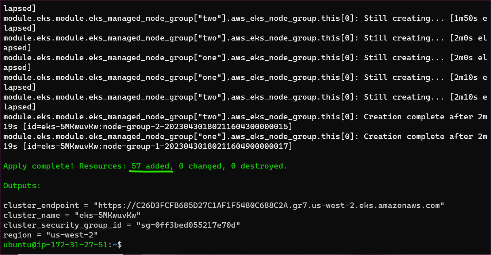


### After complete our job with eks cluster, to execute the `terraform destroy`.
```
terraform destroy
```
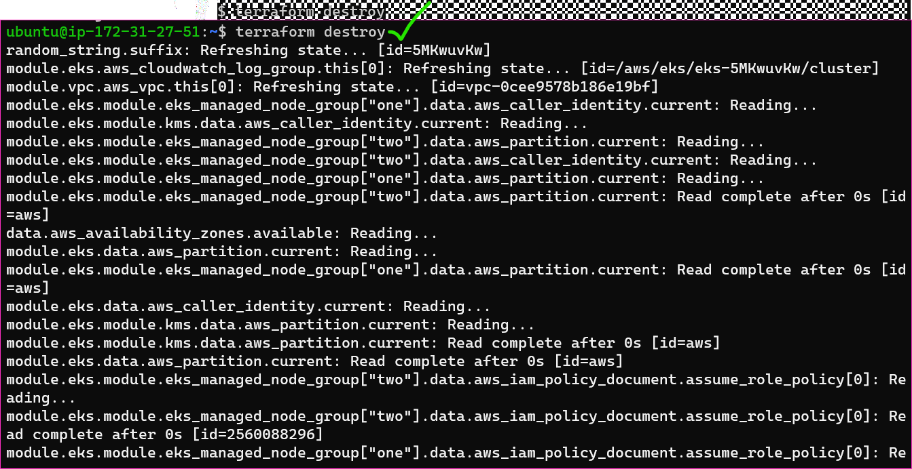
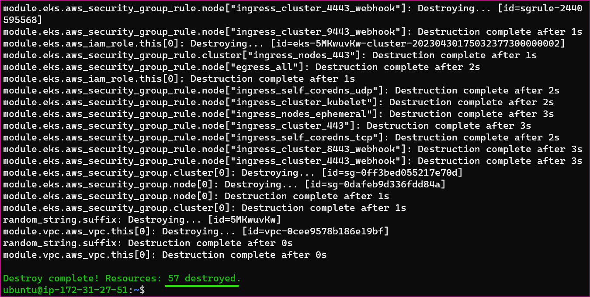

